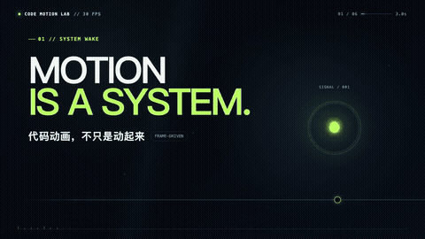
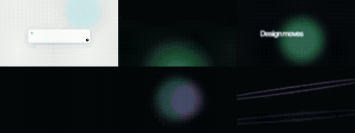
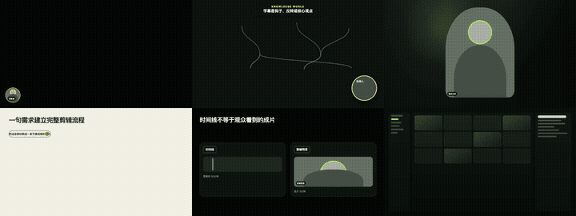
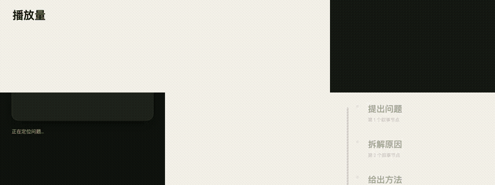
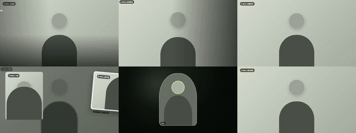

<div align="center">

# Remotion Code Motion Explainer

### Turn explanations into continuous, editable motion systems.

一个面向 AI Agent 的代码动画导演 Skill：把脚本、旁白、字幕、产品流程、技术原理和
参考视频转化为可编辑、可参数化、可逐帧验证的 Remotion 动画。

**Created by [Bingo (@DWCD-Bingo)](https://github.com/DWCD-Bingo) · Maintained under
[Vibe Motion](https://github.com/vibe-motion)**

```bash
npx skills add vibe-motion/remotion-code-motion-explainer
```

</div>

---

## 产品宣传片

<p align="center">
  <a href="./assets/showcase/code-motion-promo-30s.mp4">
    
  </a>
</p>

<p align="center"><strong>点击画面播放 30 秒宣传片</strong></p>

## 完整能力展示

<p align="center">
  <a href="./assets/showcase/code-motion-capability-showcase.mp4">
    
  </a>
</p>

它适合制作：

- AI 产品发布与 Agent 工作流
- UI 操作和软件功能演示
- 算法、物理、电路与科学原理
- 数据流、系统架构、图表和公式
- UI 录屏、参考视频与 AE 动效复刻

## 内置可编辑镜头库

公开版包含 **63 个可检索镜头条目、65 个 Remotion compositions**，覆盖横屏、竖屏和
方形布局。

### AI / UI 动效系统

<p align="center">
  <a href="./assets/showcase/shot-gallery-ai-ui.mp4">
    
  </a>
</p>

Prompt → Agent、AI 产品网格、任务卡时间线、语音 Persona、霓虹消息路径、玻璃仪表盘。

### 导演讲解与连续空间

<p align="center">
  <a href="./assets/showcase/shot-gallery-director.mp4">
    
  </a>
</p>

工作流爆炸图、SRT 知识世界、因果标签图、流程胶囊、时间线对照、教程聚光标注。

### 数据、代码与动态文字

<p align="center">
  <a href="./assets/showcase/shot-gallery-data-type.mp4">
    
  </a>
</p>

数据计数、指标回顾、重点文字、代码讲解、里程碑名单、故事时间线。

### A-roll / B-roll 视频包装

<p align="center">
  <a href="./assets/showcase/shot-gallery-aroll-broll.mp4">
    
  </a>
</p>

干净口播、重点推近、全屏 B-roll、画中画、人物媒体卡、证据链桥接。

这些不是不可编辑的 MP4 模板。每个镜头保留 TypeScript/React 源码、Props、构图逻辑和
转换契约，可替换品牌、文字、数据、画幅和时间。

## 核心优势

- **先理解，再动画**：把内容拆成“输入状态 → 动作 → 系统反应 → 可见结果 → 镜头接力”。
- **连续空间叙事**：让重要对象跨镜头持续存在并改变状态，避免 PPT 式整屏重置。
- **完整可编辑**：文字、数据、品牌、时长、波形、路径、镜头和画幅全部参数化。
- **镜头库优先**：先按语义检索，再复用、改造或新建；复用组件逻辑而不是旧成片。
- **高保真复刻**：测量阶段、几何锚点、对象拓扑、摄影机运动和节奏峰值。
- **确定性渲染**：同一帧由 `frame + fps + props + seeded data` 唯一决定。
- **质量证据闭环**：检查语义、因果、字幕、安全区、数值、最终定格、授权和隐私。

## 工作原理

```text
脚本 / SRT / 产品说明 / 技术原理 / 参考视频
                         ↓
          语义拆解：对象、动作、数字、关系、状态
                         ↓
           导演分镜 + 持续对象表 + 镜头库检索
                         ↓
             Hook / 复杂机制 / 结尾英雄静帧
                         ↓
      React + Remotion + SVG / Canvas / WebGL / 3D
                         ↓
              旁白、字幕、标签与声音事件卡点
                         ↓
         代表帧 + 运动窗口 + 联系表 + 逐帧 QC
                         ↓
              成片 + 可编辑工程 + 可复用镜头
```

## 与普通模板或文生视频的区别

| 对比项 | 普通模板 / 文生视频 | Code Motion Explainer |
| --- | --- | --- |
| 内容理解 | 关键词匹配或风格模仿 | 语义状态、动作与因果关系 |
| 镜头结构 | 独立画面拼接 | 持续对象与空间接力 |
| 可编辑性 | 通常只能局部修改 | 源码、Props、数据和时间线完整可编辑 |
| 技术表达 | 容易跳过中间过程 | 明确展示输入、转换和输出 |
| 复刻方式 | 追求“看起来相似” | 测量几何、拓扑、阶段和节奏 |
| 稳定性 | 重生成结果可能变化 | 逐帧确定性渲染 |
| 复用结果 | 重复套用成片模板 | 沉淀参数化组件和验证记录 |
| 交付物 | 通常只有视频 | 视频、工程、参数、镜头和 QC 证据 |

## 使用方式

安装：

```bash
npx skills add vibe-motion/remotion-code-motion-explainer
```

示例：

```text
使用 $remotion-code-motion-explainer，把这段产品说明制作成 16:9 的连续代码动画。
每个操作必须产生可见结果，保留可编辑参数，并输出联系表与 QC 证据。
```

Skill 的完整 Agent 工作流见 [`SKILL.md`](./SKILL.md)，镜头目录见
[`assets/shot-library/shot-library.json`](./assets/shot-library/shot-library.json)。

## 项目结构

```text
.
├── SKILL.md
├── agents/openai.yaml
├── references/
├── assets/
│   ├── showcase/
│   └── shot-library/
│       ├── src/
│       ├── scripts/
│       ├── schemas/
│       └── shot-library.json
└── LICENSE
```

## 验证

```bash
cd assets/shot-library
npm install
npm run validate:shots
npm run test:bundle
```

当前公开包已经通过：

- Skill 结构验证
- 63 项镜头清单 / 65 个 composition 注册检查
- Remotion bundle 与 composition 枚举
- UI/AE 与 SRT 驱动代表镜头实际渲染
- 个人路径、NAS 地址和隐私信息扫描

## License

MIT © 2026 Bingo and Vibe Motion contributors。第三方来源、研究边界和不可再分发内容说明见
[`assets/shot-library/SOURCES.md`](./assets/shot-library/SOURCES.md)。
